# Elyfe.Smpp - Architecture Overview

## Table of Contents
1. [Library Overview](#library-overview)
2. [System Architecture](#system-architecture)
3. [Component Relationships](#component-relationships)
4. [Data Flow](#data-flow)
5. [Protocol Stack](#protocol-stack)
6. [Threading Model](#threading-model)
7. [Error Handling Strategy](#error-handling-strategy)
8. [Configuration Management](#configuration-management)
9. [Performance Characteristics](#performance-characteristics)
10. [Deployment Considerations](#deployment-considerations)

## Library Overview

Elyfe.Smpp is a .NET implementation of the SMPP (Short Message Peer-to-Peer) protocol, designed to provide robust SMS communication capabilities for .NET applications. The library follows a layered architecture that separates concerns between high-level application interfaces, protocol handling, and low-level network communication.

### Key Features
- **Complete SMPP 3.4 Support**: Full implementation of SMPP protocol specification
- **Target Frameworks**: `netstandard2.1` and `net10.0`
- **Task-Based API**: `SendMessageAsync`/`SendPduAsync` alongside the blocking overloads
- **Automatic Reconnection**: Built-in connection management with automatic reconnection
- **Multi-Part Message Support**: Automatic handling of concatenated SMS messages
- **Event-Driven Architecture**: Comprehensive event system for message and connection handling
- **Thread-Safe Design**: Safe for use in multi-threaded environments
- **Extensible Design**: Modular architecture allowing for customization and extension
- **Pluggable Logging**: Diagnostics go through `Microsoft.Extensions.Logging`; the library takes the abstractions package only

## System Architecture

### High-Level Architecture
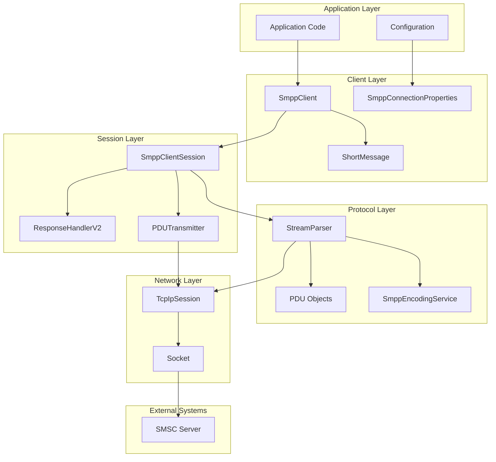

### Component Layers
1. **Application Layer**: User code and configuration
2. **Client Layer**: High-level SMPP client interface
3. **Session Layer**: Session management and coordination
4. **Protocol Layer**: SMPP protocol implementation
5. **Network Layer**: TCP/IP communication
6. **External Systems**: SMSC servers and network infrastructure

## Component Relationships

### Core Component Dependencies
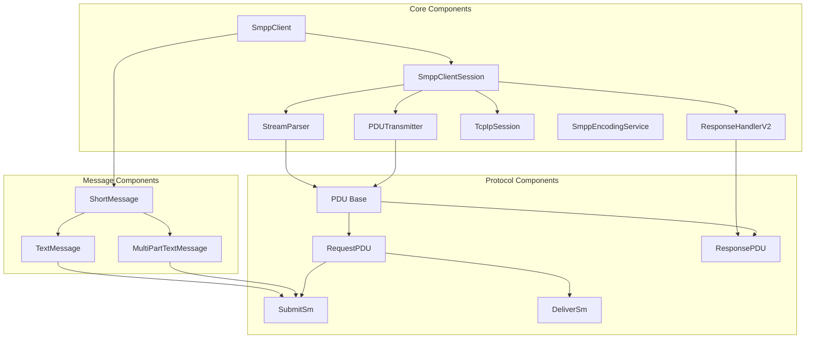

### Component Responsibilities Matrix
| Component | Primary Responsibility | Dependencies | Events |
|-----------|----------------------|--------------|--------|
| SmppClient | High-level interface, connection management | SmppClientSession, ShortMessage | ConnectionStateChanged, MessageReceived, MessageSent |
| SmppClientSession | Session coordination, PDU processing | StreamParser, PDUTransmitter, IResponseHandler | PduReceived, SessionClosed |
| StreamParser | Byte stream parsing, PDU creation | TcpIpSession, SmppEncodingService | PDUError, ParserException |
| PDUTransmitter | PDU transmission | TcpIpSession | None |
| ResponseHandlerV2 | Matching responses to waiters, timeouts, expiry of unclaimed responses | None | None |
| TcpIpSession | TCP/IP communication | Socket | SessionClosed, SessionException |
| SmppEncodingService | Character encoding/decoding | None | None |

## Data Flow

### Outgoing Message Flow
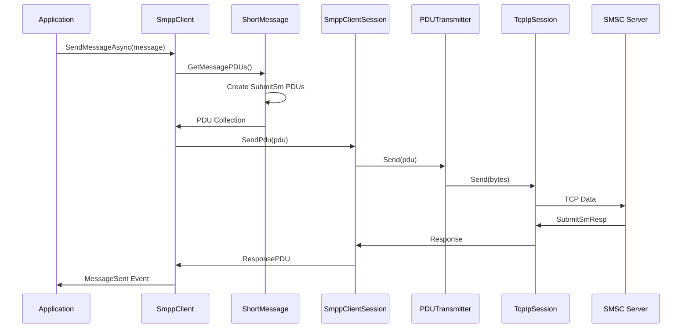

### Incoming Message Flow
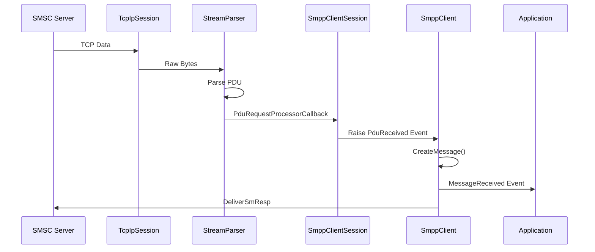

### Connection Establishment Flow
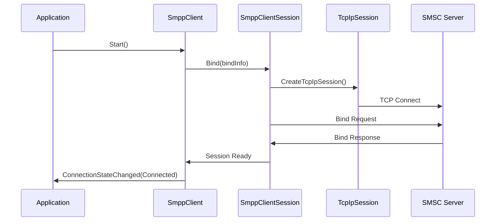

## Protocol Stack

### SMPP Protocol Layers
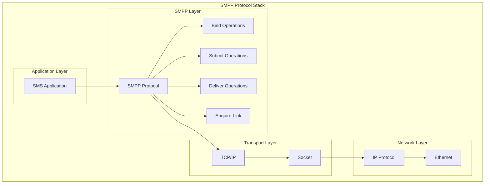

### PDU Structure
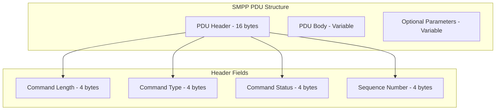

## Threading Model

### Thread Architecture
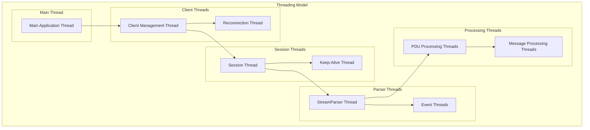

### Thread Safety
- **SmppClient**: Thread-safe for multiple operations
- **SmppClientSession**: Thread-safe with proper synchronization
- **StreamParser**: Runs in dedicated background thread
- **PDUTransmitter**: Thread-safe (stateless)
- **ResponseHandlerV2**: Thread-safe; a single lock covers waiter registration and response retention
- **TcpIpSession**: Thread-safe with connection state management

## Error Handling Strategy

### Error Hierarchy
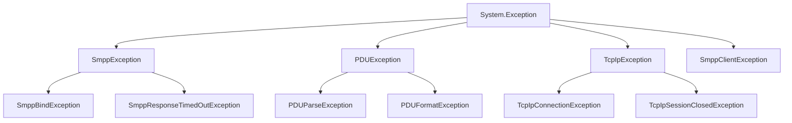

There are four independent roots, all deriving directly from `System.Exception`:

| Root | Raised by | Notable subclasses |
|------|-----------|--------------------|
| `SmppException` | Protocol-level failures; carries the SMSC's `ErrorCode` | `SmppBindException`, `SmppResponseTimedOutException` |
| `PDUException` | Malformed or unparseable PDUs | `PDUParseException`, `PDUFormatException` |
| `TcpIpException` | Transport failures | `TcpIpConnectionException`, `TcpIpSessionClosedException` |
| `SmppClientException` | `SmppClient`-level misuse and state errors | — |

`SmppException` is the one to catch around a send: `ErrorCode` holds the SMPP status the SMSC returned.

### Error Recovery Mechanisms
1. **Connection Errors**: Automatic reconnection with configurable delays
2. **Protocol Errors**: Error response generation and session continuation
3. **Message Errors**: Individual message failure handling without affecting connection
4. **Parser Errors**: Malformed PDU handling with error reporting

## Configuration Management

### Configuration Hierarchy
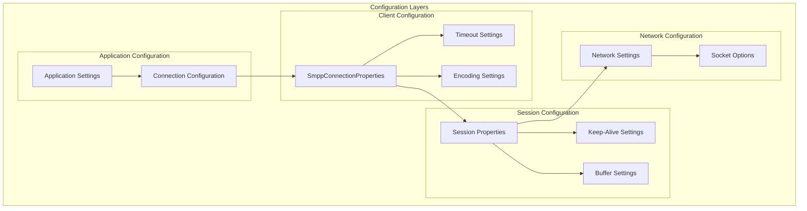

### Configuration Properties
| Level | Property | Description | Default |
|-------|----------|-------------|---------|
| Client | AutoReconnectDelay | Reconnection delay | 10000ms |
| Client | KeepAliveInterval | EnquireLink interval | 30000ms |
| Client | ConnectionTimeout | Connection timeout | 5000ms |
| Session | DefaultResponseTimeout | PDU response timeout | 5000ms |
| Session | EnquireLinkInterval | Keep-alive interval | set by `SmppClient` from `KeepAliveInterval` |
| Network | SendBufferSize | TCP send buffer | OS default (proxies `Socket.SendBufferSize`) |
| Network | ReceiveBufferSize | TCP receive buffer | OS default (proxies `Socket.ReceiveBufferSize`) |

## Performance Characteristics

### Where the time goes

End-to-end message latency is dominated by the SMSC round trip and the network path to it, not by this library — a
send blocks until the SMSC returns a `submit_sm_resp`, and how long that takes is the SMSC's business. What the
library controls is what happens either side of that wait:

- **Response matching** — `ResponseHandlerV2` is the hot path shared by every in-flight request. `Benchmarks/`
  measures it directly; run `dotnet run -c Release --project Benchmarks` for numbers on your own hardware.
- **Concatenation** — a message split into *n* segments becomes *n* `submit_sm` round trips, so its latency is
  roughly *n* times a single send.
- **Encoding** — `SmppEncodingService` allocates a byte array per conversion. UCS2 doubles the byte count of the
  text and halves the characters that fit in a segment, which is usually the more significant effect.

Throughput is bounded by the SMSC's window size and any rate limit it imposes, and by whether you use one
transceiver session or separate transmit/receive sessions. Measure against your own SMSC rather than assuming a
figure.

### Scalability Considerations
1. **Connection Pooling**: Multiple client instances for high throughput
2. **Message Queuing**: Implement queuing for burst handling
3. **Resource Management**: Monitor memory and connection usage
4. **Load Balancing**: Distribute load across multiple SMSC connections

## Deployment Considerations

### Production Deployment
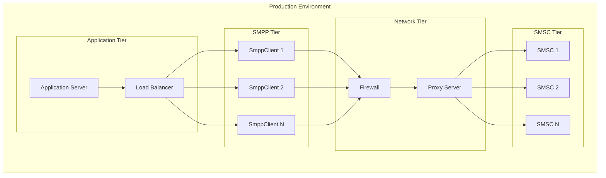

### Deployment Best Practices
1. **High Availability**: Multiple client instances with failover
2. **Monitoring**: Comprehensive logging and metrics collection
3. **Security**: Secure credential management and network security
4. **Scalability**: Horizontal scaling with load balancing
5. **Backup**: Multiple SMSC providers for redundancy

### Monitoring and Alerting
- **Connection Health**: Monitor connection state and reconnection events
- **Message Throughput**: Track message send/receive rates
- **Error Rates**: Monitor error frequencies and types
- **Resource Usage**: Monitor memory, CPU, and network usage
- **Delivery Rates**: Track message delivery success rates

Elyfe.Smpp provides a foundation for SMS communication in .NET applications, covering the SMPP protocol operations an ESME needs along with the connection management, encoding and concatenation concerns that surround them.
